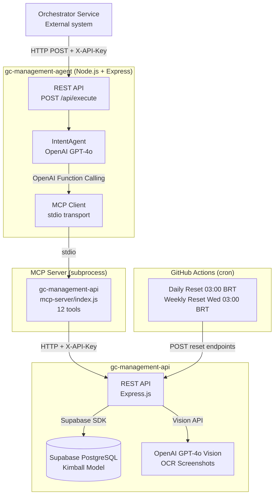
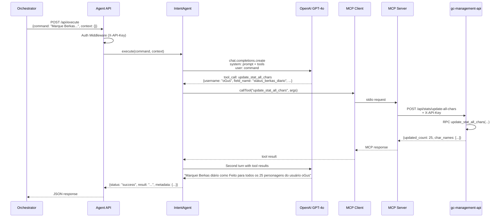
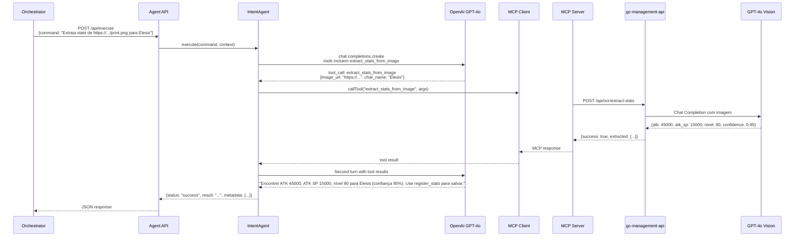
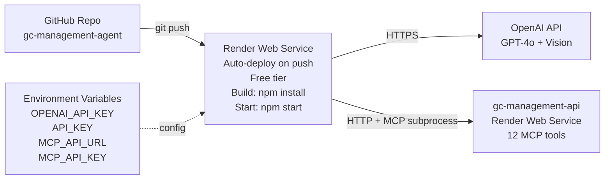

# Architecture - GrandChase Management Agent v1.2.0

## Overview

Agente intent-based que interpreta comandos em linguagem natural via OpenAI e executa ferramentas MCP (Model Context Protocol) para gerenciar personagens do GrandChase Classic.

**Versão:** 1.2.0  
**Novidades:** 12 tools MCP (inclui Discord auth + OCR), acesso a acessórios e anotações

## Stack Tecnológico



## Fluxo de Dados A2A Protocol

### Exemplo 1: "Marque Berkas diário como Feito para o usuário oGus"



### Exemplo 2: "Extraia os stats deste screenshot para Elesis" (v1.2.0 - OCR)



## Componentes

### 1. REST API Layer (`src/index.js`)

**Responsabilidades:**
- Receber comandos A2A via `POST /api/execute`
- Autenticação via API Key
- Rate limiting (50 req/15min)
- Validação de payload (Zod)
- Health check endpoint

**Middlewares:**
- `helmet` - Security headers
- `cors` - CORS policy
- `express-rate-limit` - Rate limiting
- `authMiddleware` - API Key validation
- `validate` - Schema validation

### 2. IntentAgent (`src/agent/intent.js`)

**Responsabilidades:**
- Interpretar comandos em linguagem natural
- Selecionar ferramentas MCP apropriadas
- Orquestrar chamadas OpenAI + MCP
- Formatar resposta final

**Prompt System:**
```
Você é um agente especializado em gerenciar personagens do GrandChase Classic.

Você tem acesso a 12 ferramentas via MCP que permitem:
- Gerenciar usuários e permissões Discord
- Listar usuários e personagens
- Registrar estatísticas (individual ou lote), incluindo acessórios e anotações
- Consultar histórico
- Atualizar campo em todos os 25 personagens
- Extrair atributos de screenshots via OCR

Instruções:
1. Interprete o comando
2. Identifique ferramenta(s) MCP
3. Execute ferramentas
4. Retorne resultado em português brasileiro
```

**OpenAI Function Calling:**
- Model: `gpt-4o` (ponytail: migrar para o1-mini após validação)
- Tools: Lista dinâmica de MCP tools convertida para OpenAI function schema
- Two-turn flow: request → tool_calls → results → final response

### 3. MCP Client (`src/agent/mcp-client.js`)

**Responsabilidades:**
- Spawn subprocess `node mcp-server/index.js`
- stdio transport (stdin/stdout communication)
- Enviar env vars para MCP server (API_URL, API_KEY)
- Lifecycle management (connect/close)

**Métodos:**
- `connect()` - Spawn subprocess + connect transport
- `listTools()` - Request `tools/list` from MCP server
- `callTool(name, args)` - Request `tools/call` with params
- `close()` - Kill subprocess + cleanup

### 4. Validators (`src/validators.js`)

**Schemas:**
- `executeCommandSchema`:
  - `command`: string (1-1000 chars)
  - `context`: optional record

## Segurança

### Camadas de Proteção

1. **API Key Authentication (Agent API)**
   - Header obrigatório: `X-API-Key`
   - Validado antes de executar comando

2. **API Key Authentication (MCP → Backend)**
   - MCP client passa `MCP_API_KEY` para MCP server via env
   - MCP server usa key no header `X-API-Key` ao chamar REST API

3. **Rate Limiting**
   - 50 requests / 15min por IP
   - Protege contra abuse do orchestrator

4. **Input Validation**
   - Zod schemas para A2A payload
   - Max 1000 chars no comando

5. **Subprocess Isolation**
   - MCP server roda em processo separado
   - stdio transport (sem network exposure)

6. **Helmet.js**
   - Headers de segurança HTTP

## A2A Protocol Contract

### Request Format

```json
{
  "command": "string (natural language command)",
  "context": {
    "optional": "key-value pairs for context"
  }
}
```

### Response Format (Success)

```json
{
  "status": "success",
  "result": "formatted natural language response",
  "metadata": {
    "toolsCalled": ["tool1", "tool2"],
    "model": "gpt-4o"
  }
}
```

### Response Format (Error)

```json
{
  "status": "error",
  "error": "error message"
}
```

## Deploy Architecture



## Custos Estimados

| Serviço | Tier | Custo/Mês |
|---------|------|-----------|
| OpenAI API | Pay-as-you-go | $1-5 (100 req/dia, GPT-4o) |
| OpenAI OCR | Pay-as-you-go | ~$0.10-1 (10-100 screenshots/mês) |
| Render (Agent) | Free | $0 (750h, sleep após inatividade) |
| Render (Backend) | Free | $0 (já deployado) |
| **Total** | | **$1-5/mês** |

### Otimizações de Custo

1. **Modelo:** Migrar para `gpt-4o-mini` (5x mais barato, ~$0.20/mês)
2. **Caching:** OpenAI prompt caching (50% desconto em system prompt)
3. **OCR seletivo:** Usar gpt-4o-mini vision para OCR simples (~$0.001/imagem)
4. **Alternativa Render:** Ver `.planning-alternatives.md` para free tier maior

## MCP Tools Schema (v1.2.0 - 12 Tools)

```javascript
// Discord & Permissions (5 tools)
{
  name: "create_discord_user",
  description: "Register a Discord user in the system",
  inputSchema: { discord_id: string, discord_username: string }
},
{
  name: "create_user",
  description: "Create game account linked to Discord owner",
  inputSchema: { username: string, discord_owner_id: string }
},
{
  name: "grant_permission",
  description: "Owner grants permission to edit account",
  inputSchema: { owner_discord_id: string, username: string, grant_to_discord_id: string }
},
{
  name: "revoke_permission",
  description: "Owner revokes permission",
  inputSchema: { owner_discord_id: string, username: string, revoke_from_discord_id: string }
},
{
  name: "list_permissions",
  description: "List permissions for a game account",
  inputSchema: { username: string }
},

// Data Management (6 tools)
{
  name: "list_users",
  description: "List all registered users",
  inputSchema: {}
},
{
  name: "list_characters",
  description: "List 25 GrandChase characters",
  inputSchema: {}
},
{
  name: "register_stats",
  description: "Register character stats (single). v1.2.0: inclui acessórios + anotacoes",
  inputSchema: { username, char_name, discord_id, date?, nivel?, atk_total?, atk?, atk_sp?, status_anel?, tipo_anel?, status_tornozeleira?, tipo_tornozeleira?, anotacoes?, ... }
},
{
  name: "register_stats_batch",
  description: "Register stats in batch (max 100)",
  inputSchema: { records: [...] }
},
{
  name: "query_stats",
  description: "Query stats with filters",
  inputSchema: { username?, char_name?, from_date?, to_date?, limit?, offset? }
},
{
  name: "update_stat_all_chars",
  description: "Update 1 field for ALL 25 characters. v1.2.0: whitelist expandida (18 campos incl. acessórios)",
  inputSchema: { username, discord_id, field_name, field_value, date? }
},

// OCR & Automation (1 tool)
{
  name: "extract_stats_from_image",
  description: "Extract character stats from screenshot via GPT-4o Vision. v1.2.0",
  inputSchema: { image_url?, image_base64?, char_name? }
}
```

## Ponytail (Future Optimizations)

Skipped para MVP:

1. **OpenAI o1-mini:** Requer reasoning API diferente, usar GPT-4o primeiro
2. **Context engineering:** System prompt básico, otimizar após validação
3. **Retry logic:** Adicionar quando OpenAI latency causar timeouts
4. **Circuit breaker:** Proteção contra MCP server down
5. **Telemetria:** OpenTelemetry quando escalar
6. **Multi-turn conversations:** Stateless por enquanto, adicionar session management depois

## Monitoring

### Health Checks

- `GET /health` - HTTP 200 OK = service up
- Render health check automático (free tier)

### Logs Estruturados (Pino)

```javascript
logger.info({ command, hasContext }, 'Received A2A command');
logger.info({ toolName, toolArgs }, 'Calling MCP tool');
logger.error({ error }, 'Agent execution failed');
```

### Métricas Importantes

- Latency: Command → Response (target <5s)
- OpenAI tokens: Input + Output per request
- MCP tool call success rate
- Rate limit hits
